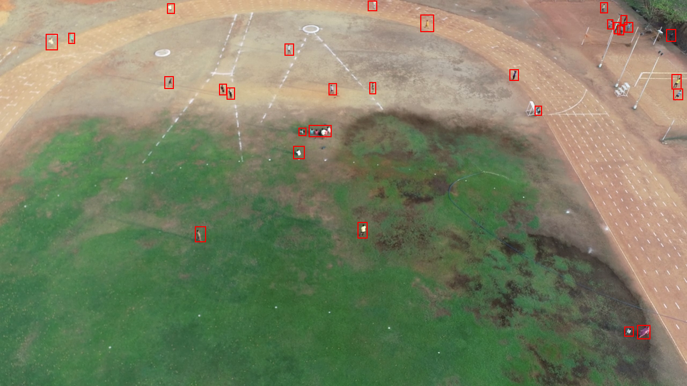

# <center>Manipal-UAV-Person Dataset</center>
### <center>Large scale UAV dataset for Person detection </center>

<p align="justify"> &emsp; Intelligent UAV video analysis has drawn the attention of a large number of researchers due to the increasing popularity of unmanned aerial vehicles in computer vision-related applications. Drones being used in applications like search and rescue, surveillance and military applications, demands automatic detection of human targets in large-scale images/videos recorded by UAVs. Small object sizes, large scale variations, dense distribution of objects, arbitrary orientations, class imbalance etc. are the major challenges exists in UAV-based small object detection. </p>


<p align="justify"> &emsp; A representative data set and the algorithms are the major requirements of small object detection. To enhance research in UAV and small object detection research community, we provide MIT UAV person detection video dataset comprising of 33 videos with 13462 sampled images and 153112 object instances with their annotations. The dataset is collected using two drone platforms DJI Mavic Pro and DJI Phantom at different locations in and around MIT campus under varying weather and lighting conditions.  The dataset contains a large number of small objects with varying scales, posture, and lighting, as well as occlusion, making human detection extremely challenging. </p>

<i> The sample images of our dataset with the annotations are shown below.</i>


| 10m height image  | 20m height image  |
|--------|-------|

| 30m height image  | 40m height image  |
|--------|-------|

| 50m height image  | Low Light image  |
|--------|-------|


## Dataset Info

* Bounding box annotations are available in COCO (json) and text formats for all the train, validation and test sets separately.
* Some of the test images are provided in this repo for simple inference purposes and can be found in the [Test Samples](https://github.com/Akshathakrbhat/Manipal-UAV-Person-Dataset/tree/master/Test%20Samples) folder.
* Annotations for the same are also provided in various formats.
* All the images from the dataset are of the size 1280x720.

## Usage Disclaimer 

* The dataset can be used only for<b> academic or research purposes </b>only (not to be used for commercial applications).

* To access the dataset, please fill the [MS Form](https://forms.office.com/r/qHy7yMbZwK). The link to download the dataset shall be shared to your email address.

* If you use this dataset in your work, please cite us using the following information.

``` citation
TBD

```
